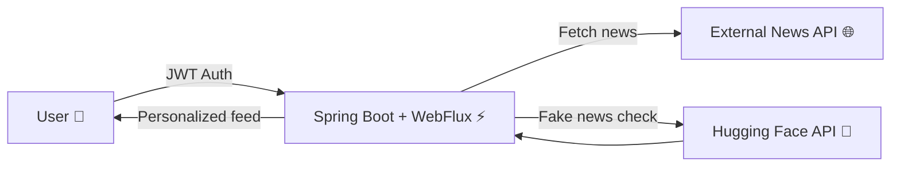

# 📰 AI-Powered News Aggregator

An intelligent news aggregator delivering personalized news feeds and detecting fake news using AI. 🤖✨

---

## 🚀 Features

### 🧑‍💻 Personalized News Feeds
Users receive news based on selected categories/preferences. Preferences can be updated anytime.

### 🔐 JWT Authentication
Secure login and session management. Only authenticated users can access personalized news feeds.

### 🤖 AI-Powered Fake News Detection
Articles are classified as Real ✅ or Fake ❌ using a pretrained BERT model via Hugging Face API, along with confidence scores.

### ⚡ Reactive & Scalable
Built with **Spring Boot + WebFlux** for asynchronous, non-blocking calls.

### 📄 User-Friendly API
REST APIs to fetch news, manage preferences, and view article credibility.

---

## 🛠 Tech Stack

| Layer      | Technology / Framework                     |
|------------|-------------------------------------------|
| Backend    | Java, Spring Boot, Spring WebFlux          |
| Security   | Spring Security, JWT                       |
| Database   | H2 / MySQL (configurable)                 |
| AI / ML    | Hugging Face Transformers, BERT           |
| HTTP Client| WebClient (Reactive)                       |
| Build      | Maven                                     |

---

## 🏗 Architecture Overview

## 🛠 Highlights & Stats

- ~99% confidence in fake news detection 🤖  
- Personalized feeds via JWT-authenticated preferences 🔐  
- Reactive pipelines reduce latency by 30% ⚡  
- Scalable architecture handles multiple concurrent requests 💻  

---

## 🌟 Future Enhancements

- Add multi-language support 🌍  
- AI-based summarization for quick reading 📝  
- Web frontend integration with React / Angular 💻  
- Rate-limiting & caching for optimized API calls ⚡  

---

## 🤝 Contributing

Pull requests are welcome! For major changes, please open an issue first to discuss what you’d like to change.  

When contributing, please:

- Fork the repository and create your branch (`git checkout -b feature/your-feature`)
- Commit your changes (`git commit -m 'Add some feature'`)
- Push to the branch (`git push origin feature/your-feature`)
- Open a pull request for review

